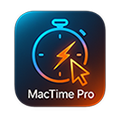
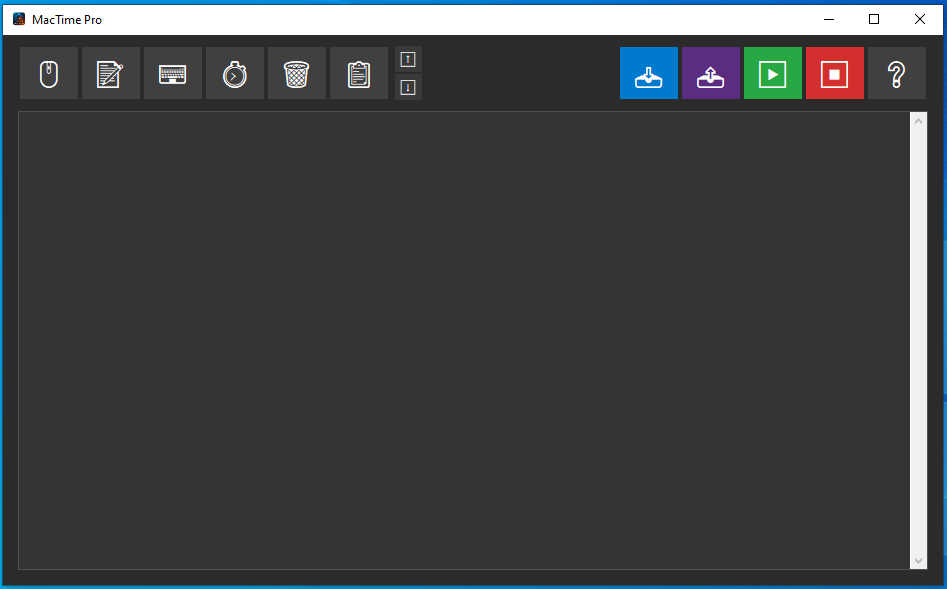

  
  
  # MacTime Pro
  
  **A ferramenta definitiva de automação para Windows.**
   
  Simples, Robusta e com Interface Moderna.

  
  
  

---

## 📖 Sobre o Projeto

O **MacTime Pro** é um software de automação (Macro Recorder/Player) desenvolvido para eliminar tarefas repetitivas. Diferente de macros comuns, ele oferece uma interface gráfica moderna (Dark UI), controle preciso sobre listas de dados e mecanismos de segurança avançados.

Projetado para ser **portátil** (não requer instalação) e intuitivo.

---

## ✨ Funcionalidades Principais

### 🖱️ Automação de Mouse & Teclado
* **Cliques:** Simples, Duplo, Botão Direito, Scroll e "Pressionar e Segurar".
* **Teclado:** Digitação de textos longos ou atalhos complexos (ex: `Ctrl+Alt+Del`*, `Win+R`).
* **Espera:** Adicione *delays* precisos entre as ações.

### 📋 Processamento de Listas (.txt)
Ideal para preenchimento de formulários em massa.
* Carregue um arquivo `.txt` e o sistema digita uma linha por execução.
* Opção inteligente de **Ignorar Linhas em Branco**.
* O sistema lembra a configuração de cada arquivo carregado.

### 🎨 Interface Moderna (UI/UX)
* **Tema Dark:** Visual confortável para uso prolongado.
* **Drag & Drop:** Arraste itens para reordenar a timeline (inclusive grupos de itens).
* **Seleção Múltipla:** Use `Shift` ou `Ctrl` para editar/remover vários itens de uma vez.
* **Legendas:** Adicione notas aos itens para lembrar o que cada passo faz.
* **Ignorar Passos:** Marque itens como "Ignorar" para pulá-los sem precisar deletar.

### 🛡️ Segurança (Safety Shake)
Se a macro sair de controle, **sacuda o mouse rapidamente** (movimento brusco esquerda/direita) para abortar a execução imediatamente. O sistema detecta o "caos" e para tudo.

---

## 📸 Capturas de Tela

  
   
  <em>Interface principal com Timeline interativa</em>

---

## 🚀 Instalação e Uso

Não é necessário instalar Python ou bibliotecas. O programa é distribuído como um executável portátil.

1.  Acesse a aba **[Releases](../../releases)** deste repositório.
2.  Baixe o arquivo **`MacTimePro.zip`** da versão mais recente.
3.  Extraia a pasta em qualquer lugar do seu computador.
4.  Execute o arquivo **`MacTimePro.exe`**.

### Guia Rápido: Criando sua primeira Macro

1.  Clique em **"🖱️ Capturar Clique"**. Posicione o mouse onde deseja clicar e aperte **ENTER**.
2.  Clique em **"📝 Adicionar Texto"** para escrever algo.
3.  Clique em **"⏱️ Adicionar Espera"** e coloque `1.0` segundo.
4.  Pressione **"▶️ Executar"**.
5.  Defina quantas vezes quer repetir (Loop) e clique em Iniciar.

> **Dica:** Dê um duplo clique em qualquer item da lista para editá-lo.

---

## ⚙️ Stack Tecnológica

* **Linguagem:** Python 3.13
* **Interface:** Tkinter (Customizado com Tema Dark)
* **Automação:** PyAutoGUI
* **Compilação:** PyInstaller

---

## 📜 Histórico de Versões (Changelog)

### [v3.0] - A Versão Definitiva
* **Novo Motor:** Reescrita total da lógica de execução para evitar travamentos.
* **Mapeamento de Teclas:** Suporte total a teclas especiais (Enter, Tab, Win, Setas).
* **UI Refinada:** Botões centralizados, ícones restaurados e cores ajustadas.
* **Correção:** Função de "Salvar Lista" agora fecha a janela corretamente.

### [v2.5] - Melhorias de Usabilidade
* **Drag & Drop Avançado:** Arraste múltiplos itens selecionados.
* **Scroll Inteligente:** A barra de rolagem só ativa quando necessário.
* **Visual:** Adicionado efeito fantasma ao arrastar itens.

### [v2.0] - O Grande Salto
* **Splash Screen:** Tela de carregamento elegante.
* **Modo Seguro:** Algoritmo "Mouse Shake" para parada de emergência.
* **Janelas Modais:** Impede clicar no fundo enquanto edita uma ação.

---

  Desenvolvido com 💙 por <b>pdrGow2</b>

